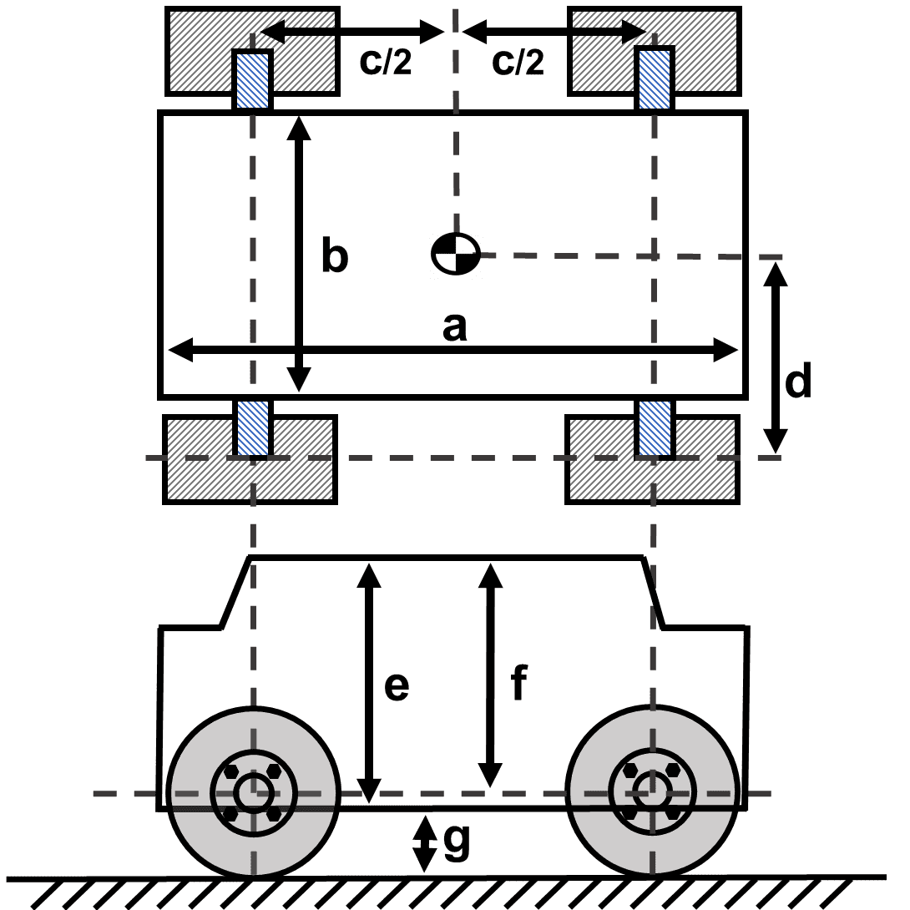
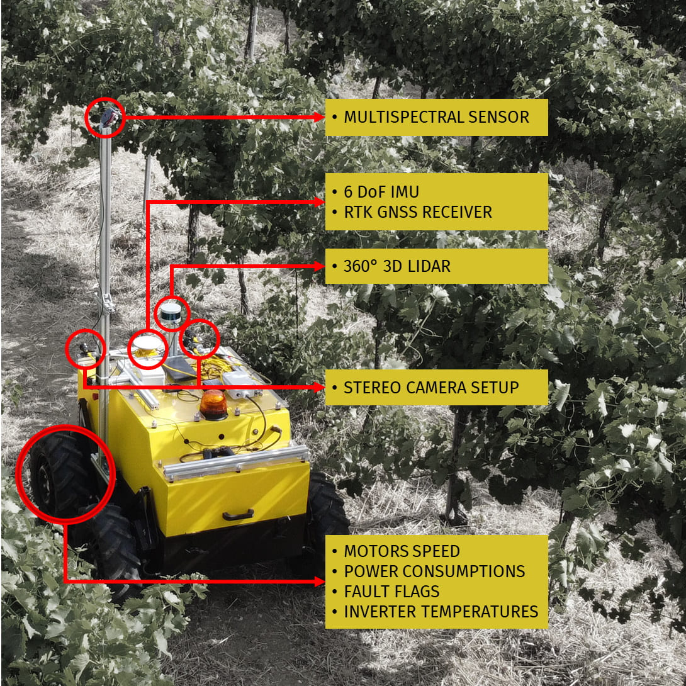
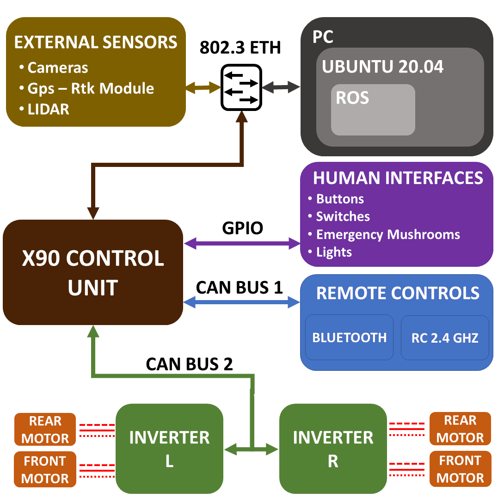
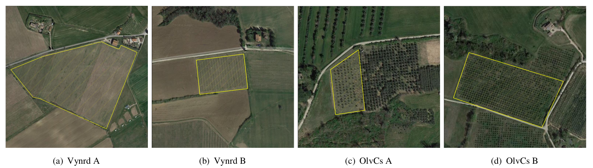
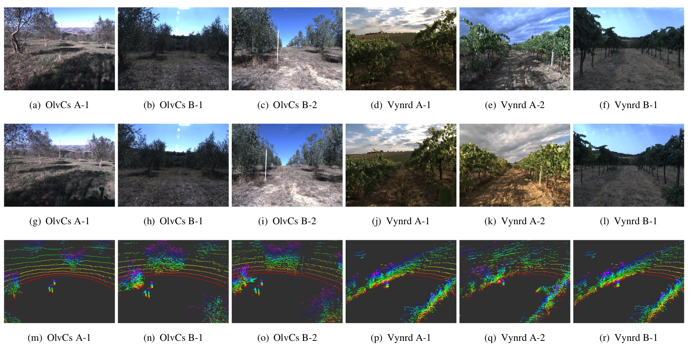
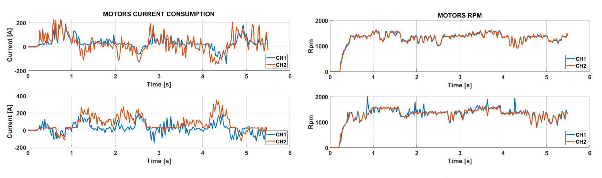
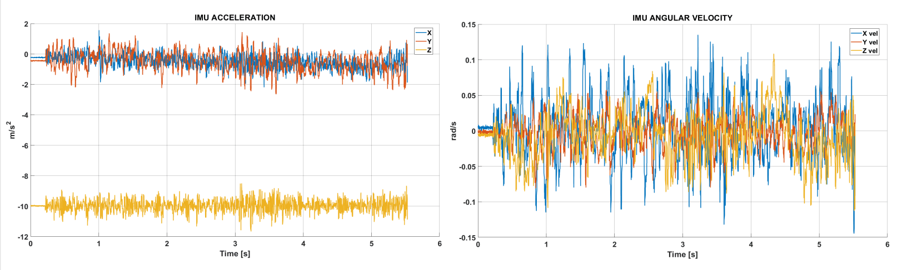
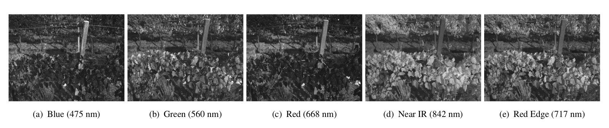
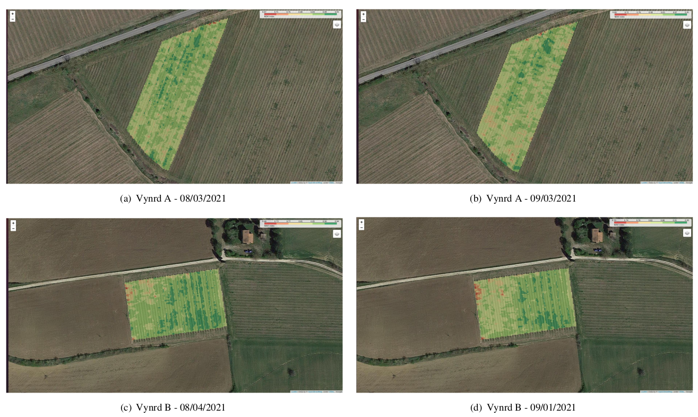

# ARD-VO: Agricultural Robot Dataset of Vineyards and Olive groves

<!-- 
***10, Mar 2021 update***</br> 
- REPOSITORY UNDER CONSTRUCTION we are uploading and building the github repo.  </br></br></br>
-->


ARD-VO is a Real-world extensive set of data to support the development of solutions and algorithms for precision 
farming technologies. </br>

## License
ARD-VO is released under the following License:

Attribution-NonCommercial-ShareAlike 3.0 [CC BY-NC-SA 3.0](LICENSE).

This means it is possible:
* to copy, distribute, display, and perform the work. 
* to make derivative works.

Under the following conditions:</br>
 - Attribution: You must give the original author credit.</br>
 - Non-Commercial — You may not use this work for commercial purposes. </br>
 - Share Alike — If you alter, transform, or build upon this work, you may distribute the resulting work only under a licence identical to this one.

**If you use ARD-VO in an academic work, please cite:**

    @article{crocetti2023ard,
      title={ARD-VO: Agricultural robot data set of vineyards and olive groves},
      author={Crocetti, Francesco and Bellocchio, Enrico and Dionigi, Alberto and Felicioni, Simone and Costante, Gabriele and Fravolini, Mario L and Valigi, Paolo},
      journal={Journal of Field Robotics},
      year={2023},
      publisher={Wiley Online Library}
    }


## 1. Project Agrobot
The AGROBOT project was funded by <i>Umbria Region PSR program 2014-2020, Focus Area
2A</i>  and aims to develop and demonstrate in real application contexts the technologies necessary to 
automate some crop scouting and monitoring operations (mainly related to olive grove and vineyard).
The explicit objective of the project is to use  state-of-the-art technologies in the field of mobile robotics 
and image processing in order to reduce the time and costs of regularly monitoring the physiological and phytosanitary crop state. 
The project outcome is a prototype vehicle able to drive autonomously, equipped with sensing equipment 
to carry out on-line agriculturally meaningful monitoring.


## 2. The robotic platform

We collected a dataset with a robotic platform so-called "Agrobot". In the following the body specs and the sensors equipments 
of the robotic platform. 

### Body Specs


<table>
  <tr>
    <th colspan="4">Robot Body Measurements</th>
  </tr>
  <tr>
    <th rowspan="4" style="align-items: center"> <br/></th>
  </tr>
  <tr>
    <td>𝑎 1.30 [𝑚]</td>
    <td>𝑏 0.77 [𝑚]</td>
    <td>𝑐 0.80 [𝑚]</td>
  </tr>
  <tr>
    <td>𝑑 0.20 [𝑚]</td>
    <td>𝑒 0.77 [𝑚]</td>
    <td>𝑓 0.74 [𝑚]</td>
  </tr>
  <tr>
    <td>𝑔 ≈ 0.24 [𝑚]</td>
    <td colspan="2">weight ≈ 700 [𝐾𝑔]</td>
  </tr>
  <tr>
    <th colspan="4">Tyres</th>
  </tr>
  <tr>
    <td colspan="4">Genial Tyre Agri Line 6.5∕80 𝑅13</td>
  </tr>
</table>

### Sensors, Equipments and connection overview
<table>
  <tr>
    <th> </th>
    <th> </th>
  </tr>

  <tr>
    <td colspan="2"> <b>Multispectral Camera:</b>  <a href="https://support.micasense.com/hc/en-us/articles/360011389334-RedEdge-MX-Integration-Guide">RedEdge MX camera</a>. </td>
  </tr>

 <tr>
    <td colspan="2"> <b>360° LIDAR:</b>  <a href="https://velodynelidar.com/products/puck-lite/">Velodyne Puck Lite</a>. </td>
 </tr>

 <tr>
    <td colspan="2"> <b>Inertial and Position measurement units:</b>  <a href="https://www.swiftnav.com/duro-inertial">Swift Duro Inertial</a>. </td>
 </tr>

 <tr>
    <td rowspan="2"> <b>Front camera rig (two units, left and right) </b>   </td>
    <td>Camera Module:  <a href="https://www.flir.com/products/blackfly-s-gige/?vertical=machine+vision&segment=iis">Blackfly S BFS-PGE-04S2C-C</a> </td>
 </tr>

 <tr>
    <td>Lens  <a href="https://www.machine-vision-shop.com/all-products/lenses/fifo-0420mm">FIFO-0420MM C-mount</a> </td>
 </tr>

 <tr>
    <td colspan="2"> <b>DC Brushless Motor Inverters:</b> Roboteq HBL2360a </td>
 </tr>

 <tr>
    <td colspan="2"> <b>X90 mobile controller:</b> <a href="https://www.br-automation.com/en/products/plc-systems/x90-mobile-control-system/">X90 mobile control system</a> </td>
 </tr>

<tr>
    <td colspan="2"> <b>Main computer:</b> Intel i7-9700E CPU with an NVIDIA GeForce RTX 2060. Two SO-DIMM slots
equip 32GB of DDR4 2666 MHz RAM. We decided to install
two different storage systems: one PCI Express x4 NVMe
1.3, 256GB for the operating system (Ubuntu 20.04 LTS 64
bit) and two SATA SSD 2.5", 2TB disks for data. </td>
 </tr>

 <tr>
    <td colspan="2"> <b>Ethernet switch:</b> Oring TGXPS-1080-M12-24V Series </td> </tr>
</table>


## 3. Data collection campaign
ARD-VO has been collected with an Unmanned Ground Vehicle (UGV) equipped with different heterogeneous sensors
that capture information essential for robot localization and plant monitoring tasks.
It is composed of sequences gathered in 11 experimental sessions between August
and October 2021, navigating the UGV for several kilometers in four cultivation
fields in Umbria, a central region of Italy: (a)-(b) vineyards, (c)-(d) olive crops


 <br/>


| Alias name |         Crop Variety          |     lat(N) , lon(E)      | # Sessions |               Date: dd, mm, yyyy                |
|:----------:|:-----------------------------:|:------------------------:|:----------:|:-----------------------------------------------:|
|  Vynrd A   |       Grechetto Todi G5       |   43.004491, 12.294889   |     1      |                3, September 2021                |
|  Vynrd B   |       Grechetto Todi G5       |   42.812355, 12.418741   |     2      |     4, August 2021  </br> 1, September 2021     |
|  OlvCs A   |           Moraiolo            |   42.967206, 12.407057   |     4      | 14-23-30, September 2021 </br> 13, October 2021 |
|  OlvCs B   | Moraiolo, Leccino, Frantoiano |   42.961702, 12.412744   |     4      | 14-23-30, September 2021 </br> 13, October 2021 |


## 4. Dataset


For each session, two sets of data are available: the first is made using the sensors connected
to the onboard computer, and the second only with the multispectral camera, whose streams are independently geotagged
by using the GPS of the RedEdge Micasese kit. 

**LINK DATASET DOWNLOAD**

http://sira.diei.unipg.it/supplementary/public/Datasets/ARD-VO/

### 4.1 ROSBAG for onboard devices recorded data.

We used **[ROS Noetic](http://wiki.ros.org/noetic)** to handle the data
related to the devices directly connected to the onboard unit, while the multispectral images are stored directly on the SSD
memory of the RedEdge camera. Since the duration of the sessions may vary between one and two hours, each one is split
into a number of shorter sequences. </br>

The rosbag package allows recording these topics and
messages in a unique file that can be executed in batches to
reproduce the experiment. The following table reports a description of the
collected data, the message types, and the topics available in
this dataset.

<table>
  <tr>
    <th> Topic </th>
    <th> Message Type </th>
    <th> Description </th>
  </tr>
  <tr>
    <td><i>/flir_adk/front/left/image_raw</i> </br>/flir_adk/front/right/image_raw </td>
    <td> sensor_msgs/Image</td>
    <td> Raw images from the frontal FLIR cameras.</td>
  </tr>
  <tr>
    <td><i>/gps/duro/current_pose</i></td>
    <td> geometry_msgs/PoseStamped</td>
    <td> (𝑥, 𝑦, 𝑧) metric position and orientation (quaternion)</td>
  </tr>

  <tr>
    <td><i>/gps/duro/fix</i></td>
    <td> sensor_msgs/NavSatFix</td>
    <td> GPS lat/long with variance.</td>
  </tr>

  <tr>
    <td><i>/gps/duro/imu</i></td>
    <td> sensor_msgs/Imu</td>
    <td> Angular velocity and acceleration about (𝑥, 𝑦, 𝑧) axes.</td>
  </tr>

  <tr>
    <td><i>/gps/duro/odom</i></td>
    <td>nav_msgs/Odometry</td>
    <td> Estimates of position and velocity with the respect to the reference frame.</td>
  </tr>

  <tr>
    <td><i>/gps/duro/rollpitchyaw</i></td>
    <td>geometry_msgs/Vector3</td>
    <td> Orientation.</td>
  </tr>

  <tr>
    <td><i>/velodyne_points</i></td>
    <td>sensor_msgs/PointCloud2</td>
    <td>Velodyne laser scanned points transformed in the original frame of reference.</td>
  </tr>

  <tr>
    <td><i>/agrobot/Inverter/HBL2360A_L</i> </br><i>/agrobot/Inverter/HBL2360A_R</i> </td>
    <td> diagnostic_msgs/DiagnosticArray</td>
    <td> Diagnostic messages from the Inverters.</td>
  </tr>
</table>

### 4.1.1 Extracted data examples

#### RGB AND LIDAR
In the following, as en example some RGB images and laser scans extracted from ARD-VO dataset.</br>
The first two rows contain the RGB images collected by the left (a-f) and the right (g-l) cameras, respectively. </br>
The third row includes examples of laser scans. The first three columns (a-c, g-i, m-o) contain samples from the sequences gathered
in the olive crops (OlvCS-A,B), while the latter three (d-f, j-l, p-r) from those collected in the vineyards (Vynrd-A,B).

 <br/><br/>

#### INVERTERS 
The topics related to the inverters contain useful diagnostic data and flags provided from the inverters. 
Some flags are coded according to the manufacturer (Roboteq) specs. To further use them you need to download the inverter manual already
provided in the previous table.
Each inverter has two channels (CH1,CH2) that are used to drive the front and rear wheels of each side (Left and Right) of the robot.
The gathered data also include RPM of the motors and the power consumption.  

 <br/>

**Note:** Each wheel is connected with a kinematic chain of 80:1 transmission ratio to a 2 kW three-phase brushless BLCD motor that can reach
4300 rpm and 4.6 Nm torque.</br>

#### DURO IMU AND GPS-RTK

The Duro intertial device provides GNSS + INS position with a centimeter-level accuracy at up to 10Hz Update Frequency. 
The latitude/longitude measurements with variance are provided within a specific topic. It should be noted that the topic /gps/duro/imu
containing theThe IMU messages does not include the orientation but only accelerations and angular velocities. 
The orientation is computed by the IMU firmware and published on the following topics: /gps/duro/rollpitchyaw, /gps/duro/current_pose
and /gps/duro/odom. The image below shows an example of accelerations and angular velocities extracted from a sequence.

 <br/>

### 4.1.2 Post-processing 
Due to voltage oscillations, shocks, network congestion, and
ROS node miscommunications, we experienced spurious and
corrupted frames among the raw RGB image sets.</br>
In order to produce a high-quality dataset, the collected video sequences
were, therefore, subjected to a frame-by-frame automated check to ensure their integrity and guarantee frames equally
spaced in time. <br>
As a result, the image streams in the postprocessed sequences are free from corrupted data and characterized by a framerate in the range of 8-10 FPS. </br>

The un-processed (raws) sequences are also provided in separate folders for completeness and further studies. 

### 4.2 Multispectral data
We employed a RedEdge MX camera. </br>
#### 4.2.1 Images data
The module shots five different images  with a fixed resolution of 1280x960 pixels at 1 Hz, corresponding to different bands:
- Blue,475 (32)
- Green, 560 (27)
- Red, 668 (14)
- Red, Edge 717 (12)
- Near, IR 842 (57)</br>

with the following convention: Band-name,CenterFrequency (Bandwidth).

The following figure shows an example of a set of images referring to the same subject.

 <br/>

#### 4.2.2 Calibration
Before each experimental session, radiometric calibration is
performed to compensate for sensor black-level, sensor sensitivity, sensor gain and exposure settings, and lens vignette
effects. The radiometric model is used to normalize the pixel value in the range 0 to 1: dividing the raw digital number for
the pixel by 2𝑁 , where 𝑁 is the number of bits in the image: in this case we selected 16-bit thus 𝑁 = 65536.</br>
This normalization applies to both pixel and black-level values.


#### 4.2.3 Data
The camera embeds five optimized imagers with their sensor and filter. The camera module also has one stand-alone external GPS
to geotag the images. all the information are stored in the meta-data (EXIF) of the images that can be extracted with dedicated
tools or programming libraries:
- Python: [exif](https://pypi.org/project/exif/), [Pillow](https://pypi.org/project/Pillow/) packages
- C++: [exiv2](https://exiv2.org/)

**Note:** the images are not synchronized with the rest of the data.
Nonetheless, the metadata associated with the images provides the GPS and the timestamp information can be used to perform
the alignment with the other sensors. Since, depending on the needs, there might be different strategies to achieve this alignment, 
we preferred to keep the images provided by the sensor, leaving to the users the possibility to implement
the post-processing and the alignment procedures as deemed appropriate.

#### 4.2.4 Examples of stand-alone study
The availability of isolate geotagged multi-spectral images allows to perform studies that are not directly related to 
robotics, so there is no need to download the entire dataset. </br>
The following set of images shows as example, the NDVI maps computed
for the four cultivation using just the multispectral images.

 <br/>

### 4.3 Data organization

```shell
ARD-VO
├── Processed 
│   ├── Olvcs A
│   │     └── 13_Oct_2021
│   │     │        └── 2021-10-13-12-43-46_clean.bag
│   │     │        └── 2021-10-13-12-53-28_clean.bag
│   │     └── ....
│   │     └── 30_Sep_2021
│  ...
│   └── Vynrd B
│         └── 01_Sep_2021
│         │        └── 2021-09-01-10-49-44_clean.bag
│         │        └── ....
│         │        └── 2021-09-01-12-25-09_clean.bag
│         └── 04_Aug_2021
├── Raw
│   ├── Olvcs A
│   │     └── 13_Oct_2021
│   │     │        └── 2021-10-13-12-43-46.bag
│   │     │        └── 2021-10-13-12-53-28.bag
│   │     └── ....
│   │     └── 30_Sep_2021
│  ...
│   └── Vynrd B
│         └── 01_Sep_2021
│         │        └── 2021-09-01-10-49-44.bag
│         │        └── ....
│         │        └── 2021-09-01-12-25-09.bag
│         └── 04_Aug_2021
└── Multispectral
```


## 5. Partners
 <br/>

The project consortium comprises the Engineering Department, University of Perugia; the Agricultural, Food and
Environmental Sciences Department, University of Perugia; the Institute of Life Sciences, Sant’Anna School of Advanced
Studies; Cratia srl; Assoprol Umbria soc. coop. Agr; the “Ciuffelli Einaudi” Technical Agricultural Institute; 
and Infomobility srl. 
<!--
 - **Cratia srl** is a company specialised in training, consultancy and management for the agricultural 
and agro-industrial sector, owned by Confagricoltura Umbria, with a strong expertise in cooperation and innovation projects. Cratia role within the
Agrobot project, in addition to coordination and administration, is to support and take part into field experimental and
demonstration tests.
 - **Assoprol Umbria soc. coop. Agr.**, a major organization of oil
and olive producers of Umbria, has the aims to work toward
the improvement and the enhancement of the production of
extra-virgin olive oil, including through cooperation and innovation projects. Within the Agrobot project Assoprol, beside
administrative and management tasks, will support the consortium both with end-user involvement and result dissemination.
 - **The “Ciuffelli Einaudi” Technical Agricultural Institute** will cooperate to the field experimental and demonstration tests.
 - **Infomobility srl**, a company quite active in the automotive, infomobility and machine control areas, will develop the main
control station and some of the sensing equipment.
-->
