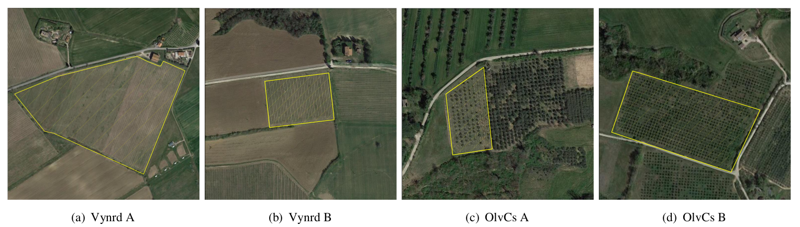
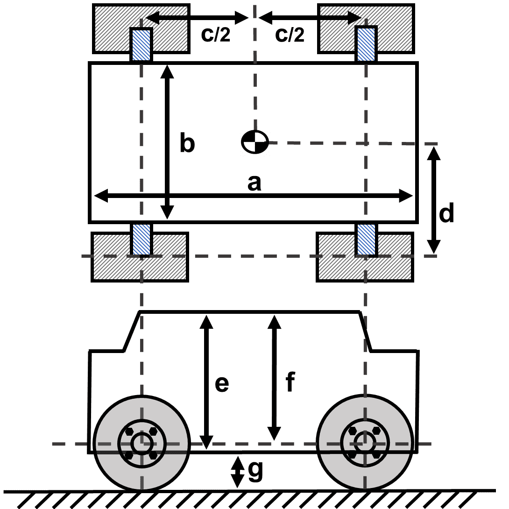
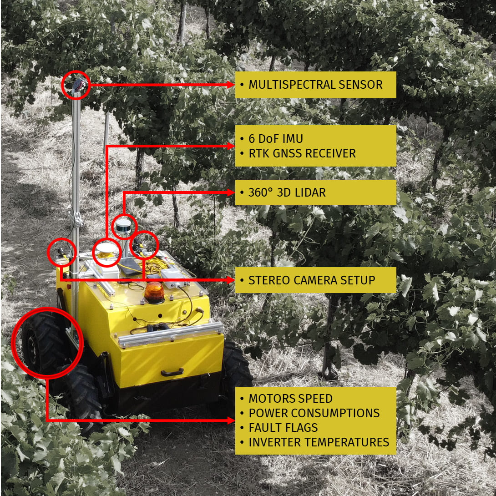
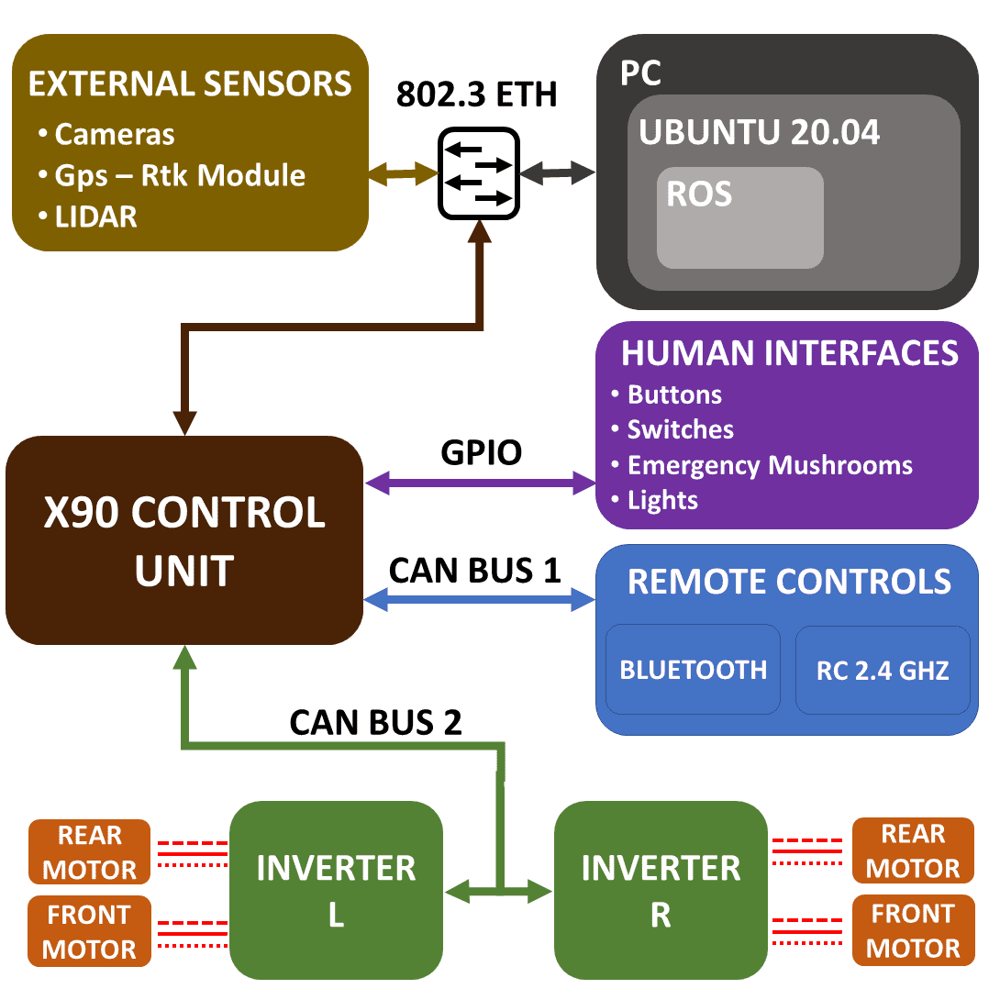

# ARD-VO: Agricultural Robot Dataset of Vineyards and Olive groves

***09, Mar 2021 update***  
- REPOSITORY UNDER CONSTRUCTION we are uploading and building the github repo.     

Real-world extensive set of data to support the development of solutions and algorithms for precision farming technologies in the aforementioned crops. ARD-VO has been collected with an
Unmanned Ground Vehicle (UGV) equipped with different heterogeneous sensors
that capture information essential for robot localization and plant monitoring tasks.
It is composed of sequences gathered in 11 experimental sessions between August
and October 2021, navigating the UGV for several kilometers in four cultivation
fields in Umbria, a central region of Italy.

  

| Alias name |         Crop Variety          |     lat(N) , lon(E)      | # Sessions |               Date: dd, mm, yyyy                |
|:----------:|:-----------------------------:|:------------------------:|:----------:|:-----------------------------------------------:|
|  Vynrd A   |       Grechetto Todi G5       |   43.004491, 12.294889   |     1      |                3, September 2021                |
|  Vynrd B   |       Grechetto Todi G5       |   42.812355, 12.418741   |     2      |     4, August 2021    1, September 2021     |
|  OlvCs A   |           Moraiolo            |   42.967206, 12.407057   |     4      | 14-23-30, September 2021   13, October 2021 |
|  OlvCs B   | Moraiolo, Leccino, Frantoiano |   42.961702, 12.412744   |     4      | 14-23-30, September 2021   13, October 2021 |

## 1. License
ARD-VO is released under a [GPLv3 license](LICENSE).

If you use ARD-VO in an academic work, please cite:

    @article{crocetti2023ard,
      title={ARD-VO: Agricultural robot data set of vineyards and olive groves},
      author={Crocetti, Francesco and Bellocchio, Enrico and Dionigi, Alberto and Felicioni, Simone and Costante, Gabriele and Fravolini, Mario L and Valigi, Paolo},
      journal={Journal of Field Robotics},
      year={2023},
      publisher={Wiley Online Library}
    }

## 2. Agrobot - The robotic platform

We collected a dataset with a robotic platform so-called "Agrobot". In the following the body specs and the sensors equipments 
of the robotic platform. 

### Body Specs

<table>
  <tr>
    <th colspan="4">Robot Body Measurements</th>
  </tr>
  <tr>
    <th rowspan="4">  </th>
  </tr>
  <tr>
    <td>𝑎 1.30 [𝑚]</td>
    <td>𝑏 0.77 [𝑚]</td>
    <td>𝑐 0.80 [𝑚]</td>
  </tr>
  <tr>
    <td>𝑑 0.20 [𝑚]</td>
    <td>𝑒 0.77 [𝑚]</td>
    <td>𝑓 0.74 [𝑚]</td>
  </tr>
  <tr>
    <td>𝑔 ≈ 0.24 [𝑚]</td>
    <td colspan="2">weight ≈ 700 [𝐾𝑔]</td>
  </tr>
  <tr>
    <th colspan="4">Tyres</th>
  </tr>
  <tr>
    <td colspan="4">Genial Tyre Agri Line 6.5∕80 𝑅13</td>
  </tr>
</table>

### Sensors, Equipments and connection overview
<table>
  <tr>
    <td> </td>
    <td> </td>
  </tr>

  <tr>
    <td colspan="2"> <b>Multispectral Camera:</b>  <a href="https://support.micasense.com/hc/en-us/articles/360011389334-RedEdge-MX-Integration-Guide">RedEdge MX camera</a>. </td>
  </tr>

 <tr>
    <td colspan="2"> <b>360° LIDAR:</b>  <a href="https://velodynelidar.com/products/puck-lite/">Velodyne Puck Lite</a>. </td>
 </tr>

 <tr>
    <td colspan="2"> <b>Inertial and Position measurement units:</b>  <a href="https://www.swiftnav.com/duro-inertial">Swift Duro Inertial</a>. </td>
 </tr>

 <tr>
    <td rowspan="2"> <b>Frontal camera rig (two units, left and right) </b>   </td>
    <td>Camera Module:  <a href="https://www.flir.com/products/blackfly-s-gige/?vertical=machine+vision&segment=iis">Blackfly S BFS-PGE-04S2C-C</a> </td>
 </tr>

 <tr>
    <td>Lens  <a href="https://www.machine-vision-shop.com/all-products/lenses/fifo-0420mm">FIFO-0420MM C-mount</a> </td>
 </tr>

 <tr>
    <td colspan="2"> <b>DC Brushless Motor Inverters:</b> Roboteq HBL2360a </td>
 </tr>

 <tr>
    <td colspan="2"> <b>X90 mobile controller:</b> <a href="https://www.br-automation.com/en/products/plc-systems/x90-mobile-control-system/">X90 mobile control system</a> </td>
 </tr>

<tr>
    <td colspan="2"> <b>Main computer:</b> Intel i7-9700E CPU with an NVIDIA GeForce RTX 2060. Two SO-DIMM slots
equip 32GB of DDR4 2666 MHz RAM. We decided to install
two different storage systems: one PCI Express x4 NVMe
1.3, 256GB for the operating system (Ubuntu 20.04 LTS 64
bit) and two SATA SSD 2.5", 2TB disks for data. </td>
 </tr>

 <tr>
    <td colspan="2"> <b>Ethernet switch:</b> Oring TGXPS-1080-M12-24V Series </td> </tr>
</table>
